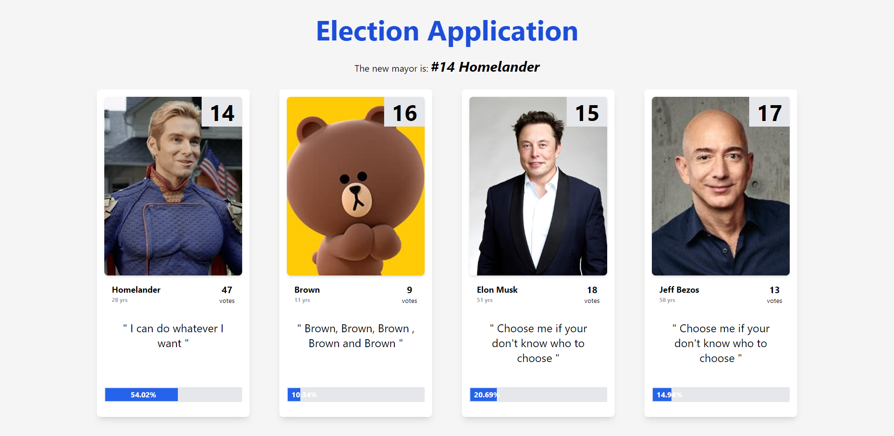
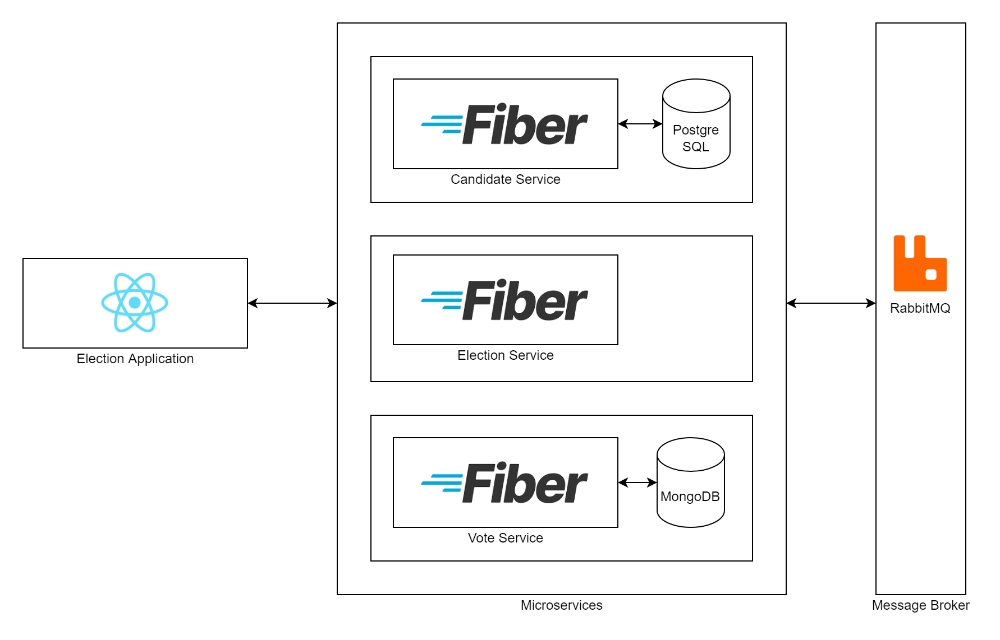

# Election Application

## How to run

### Run with docker-compose

```cmd
$ docker-compose up -d
```

## Screenshot



## Architecture



### Services

- Front-end
  - Election Application
- Back-end
  - Candidate Service
  - Election Service
  - Vote Service
- Database
  - PostgreSQL for candidate service
  - MongoDB for vote service
- Other
  - RabbitMQ for message broker

## Reference

- [React.js](https://reactjs.org/)
- [Tailwind CSS](https://tailwindcss.com/)
- [Go Fiber](https://docs.gofiber.io/)
- [PostgreSQL](https://www.postgresql.org/)
- [MongoDB](https://www.mongodb.com/)
- [RabbitMQ](https://www.rabbitmq.com/)
- [Docker](https://www.docker.com/)